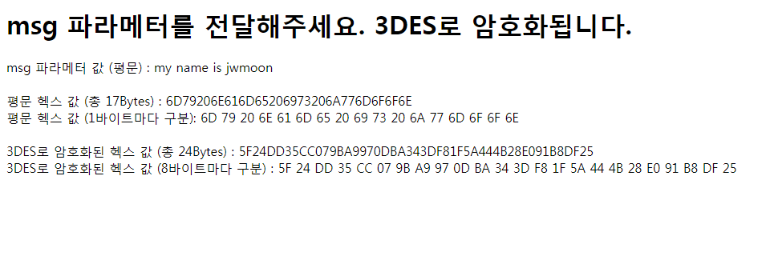
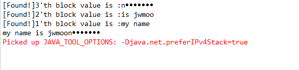

<h2>Table of Contents</h2>

<ul>
<li><a href="#sec-1">1. 개요</a></li>
<li><a href="#sec-2">2. 암호화</a></li>
<li><a href="#sec-3">3. 결과</a></li>
</ul>

# 개요

-   패딩 오라클 공격 샘플 프로젝트입니다.
-   사용의 책임은 사용자에게 있습니다. 연구목적으로만 사용하기 바랍니다.

# 암호화

로컬 서버에 올려서 암호화/복호화를 테스트 할 수 있습니다.

# 결과

결과 샘플은 다음과 같습니다. 

